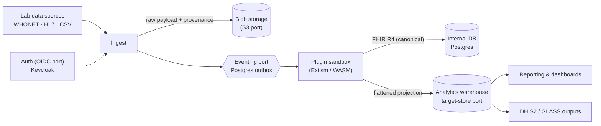

# OpenLDR Community Edition

**A FHIR-native laboratory data integration engine, analytics warehouse, and reporting platform for national lab networks.**

[](#status)
[](#license)
[](#tech-stack)
[](#contributing)

OpenLDR CE ingests heterogeneous laboratory data from any source, normalizes it to **FHIR R4**, persists it to a database the implementing organization controls, and produces domain analytics and surveillance reports — with a strong focus on **antimicrobial resistance (AMR)** surveillance in public-health settings.

---

## Status

> ⚠️ **Early, active development.** OpenLDR CE is a clean-slate rebuild and is **not yet production-ready**. Module structure, APIs, and configuration will change as the foundation stabilizes. This README will evolve with the project.

See the [Roadmap](#roadmap) for what's built versus planned.

---

## Why OpenLDR CE

It is built around three commitments learned from real Ministry-of-Health deployments:

- **Data portability is a trust guarantee.** An implementing organization can always extract its complete dataset in open formats, on its own, at any time. No lock-in.
- **Accountability by default.** Every record carries its provenance — what produced it, which plugin and version processed it, and when. Nothing enters the warehouse anonymously.
- **The organization owns its storage.** Final analytics data lands in a database the client chooses (PostgreSQL by default; others behind a swappable adapter), in their own environment.

---

## Architecture

OpenLDR CE is a **modular monolith** with a hexagonal (ports-and-adapters) core: every external dependency sits behind an interface and can be swapped without touching domain logic.



**Two databases, by design:**

- **Internal DB** (always PostgreSQL) — operational state only: users, audit log, queue/outbox, pipeline state, configuration.
- **Analytics warehouse** (client-chosen; PostgreSQL by default, SQL Server and others via adapter) — the system of record for domain data (requests, results, isolates, patients, facilities). It receives **flattened, relational** projections of the FHIR data, so it stays portable across database engines.

**The four ports** (each with a default adapter, all swappable per deployment):

| Port | Default adapter |
|------|-----------------|
| Auth (OIDC) | Keycloak |
| Blob storage (S3 API) | MinIO |
| Eventing / orchestration | Postgres outbox + `pg_notify` |
| Target data store | PostgreSQL |

**Plugins** are sandboxed, **any-language** format adapters (built on Extism/WASM). A plugin reads an arbitrary input format — for example a WHONET SQLite export — validates it, and converts it to FHIR R4, without rebuilding the application.

---

## Tech Stack

| Layer | Choice |
|-------|--------|
| Language | TypeScript (end-to-end) |
| Monorepo | Turborepo |
| Package manager | pnpm |
| Backend | Fastify |
| Query layer | Kysely (Postgres · MySQL · SQL Server · SQLite) |
| Databases | PostgreSQL (internal + default warehouse) |
| Plugin runtime | Extism / WASM |
| Data model | FHIR R4 (hand-rolled over the official schema) |
| Frontend | React + Vite + Tailwind + shadcn/ui |
| i18n | react-i18next (English · French · Portuguese) |
| Auth | Keycloak (OIDC) |
| Blob storage | MinIO (S3-compatible) |
| E2E / UI testing | Playwright |
| Reverse proxy / TLS | nginx (single HTTPS port; Let's Encrypt) |

---

## Getting Started

> The quick start reflects the intended developer workflow as Phase 1 stabilizes.

### Prerequisites

- Node.js 20+ (LTS)
- pnpm (see `package.json` for the pinned version)
- Docker & Docker Compose (for PostgreSQL, MinIO, and Keycloak in local dev)

### Setup

```bash
# Clone
git clone <repo-url> openldr_ce
cd openldr_ce

# Install workspace dependencies
pnpm install

# Copy and edit environment configuration
cp .env.example .env

# Start local infrastructure (Postgres, MinIO, Keycloak)
docker compose up -d

# Run database migrations
pnpm openldr db migrate

# Start the API (terminal 1)
pnpm -C apps/server dev

# Start the web app (terminal 2)
pnpm -C apps/studio dev
```

### The CLI

OpenLDR CE ships a first-class CLI so the entire system is drivable and inspectable from the command line — useful for operators and for automated troubleshooting. Every command supports `--json`.

```bash
pnpm openldr health                 # check every adapter (auth, storage, eventing, store)
pnpm openldr ingest ./sample.sqlite # run a file through the pipeline
pnpm openldr pipeline status        # inspect pipeline / queue state
pnpm openldr plugin list            # installed ingestion plugins
pnpm openldr export                 # extract the full dataset in open formats
```

For the complete source-backed CLI, configuration, HTTP API, and operator references, see [`docs/CLI-REFERENCE.md`](docs/CLI-REFERENCE.md), [`docs/CONFIGURATION.md`](docs/CONFIGURATION.md), [`docs/HTTP-API.md`](docs/HTTP-API.md), and [`docs/OPERATOR-GUIDE.md`](docs/OPERATOR-GUIDE.md).

---

## Project Structure

```
openldr_ce/
├── apps/
│   ├── server/         # Fastify API + built-SPA host
│   └── web/            # React + Vite SPA
├── e2e/                # Playwright smoke, capture, and docs screenshots
├── packages/
│   ├── audit/          # append-only audit store
│   ├── bootstrap/      # application context wiring
│   ├── cli/            # OpenLDR CLI
│   ├── config/         # environment schema
│   ├── dashboards/     # dashboard models, compile, SQL runner
│   ├── db/             # internal/external schemas and migrations
│   ├── dhis2/          # DHIS2 aggregate/tracker domain logic
│   ├── forms/          # FHIR Questionnaire / SDC form engine
│   ├── marketplace/    # signed artifact bundle lifecycle
│   ├── plugins/        # Extism/WASM runtime
│   ├── reporting/      # AMR/GLASS report catalog
│   ├── terminology/    # terminology and ontology services
│   ├── users/          # local user profiles
│   └── workflows/      # workflow builder runtime and stores
└── docs/               # operator docs, audit output, plans, and specs
```

---

## Deployment

OpenLDR CE is designed to run behind a **single HTTPS port**. Production environments often allocate only one or two ports, so an nginx reverse proxy terminates TLS (via Let's Encrypt/Certbot) and routes the SPA, API, and auth callbacks under one origin. All application code is proxy-relative — no hard-coded hosts or ports.

A ready-to-run Docker stack (app + nginx + Postgres/MinIO/Keycloak) lives in `Dockerfile` + `docker-compose.prod.yml`. See **[DEPLOYMENT.md](DEPLOYMENT.md)** for the build, TLS setup, environment reference, and smoke check.

---

## Roadmap

Detailed phase PRDs live in [`docs/`](docs/).

- [ ] **Phase 1 — The Spine** *(in progress)*
  Hexagonal core + the four ports, FHIR R4 data layer, forms-from-templates engine, ingest pipeline with provenance, Extism/WASM plugin runtime + WHONET SQLite reference plugin, multi-driver reporting, audit log, decoupled users, CLI, Playwright harness.
- [ ] **Phase 2 — Country-Deployable AMR Surveillance**
  SQL Server warehouse adapter, terminology service (LOINC + AMR reference), DHIS2 integration (aggregate + tracker, mapping-driven), WHO GLASS-aligned report pack, HL7 v2 & CSV plugins, in-app documentation.
- [ ] **Phase 3 — Ecosystem & Extensibility**
  Marketplace for plugins, forms, and reports — local-first, with signed artifacts, capability-based permissions, and an audited install lifecycle.
- [ ] **Phase 4 — Intelligence** *(candidate)*
  AI/agentic services over the FHIR/warehouse data: assisted mapping, data-quality detection, MCP-exposed tools.

---

## Contributing

Contributions are welcome. A few conventions:

- Use **pnpm** (workspaces). Commit the lockfile; do not use npm or yarn.
- Keep commits small and scoped; reference the relevant requirement IDs from the phase PRDs where practical.
- Commits should not include AI co-authorship trailers — authorship belongs to the human contributor.
- Add Playwright coverage for new UI surfaces and tests for new core logic.
- **Run built artifacts, not just build them.** Dev and tests execute TypeScript from source (`tsx`/`vitest`), so a bundling regression in the `tsup` ESM output can pass everything and still crash the shipped binary at startup. Acceptance for `@openldr/cli` and `apps/server` must launch the `dist/` artifact — run `pnpm build:check` (or `pnpm --filter <pkg> build:check`), which builds each binary and smoke-runs it.

The formal contributing guide is still pending; until it lands, follow the conventions above and the verification commands in this README.

---

## License

OpenLDR CE is intended to be released under the **GNU Affero General Public License v3.0 (AGPL-3.0)** for the core, with a permissively licensed **plugin SDK** so third parties can author and distribute plugins under their own terms across the sandboxed plugin boundary. Licensing is being finalized — see the `LICENSE` file once published.
