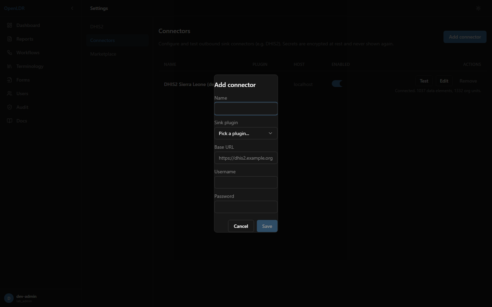
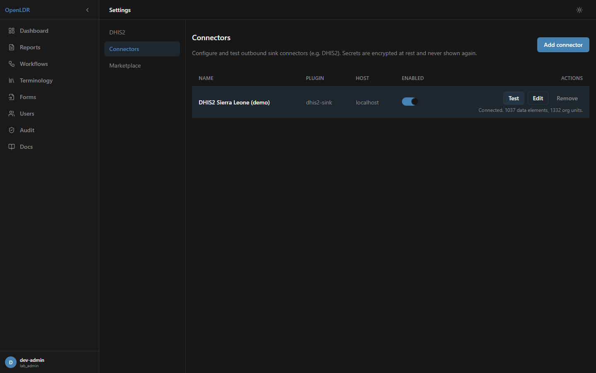
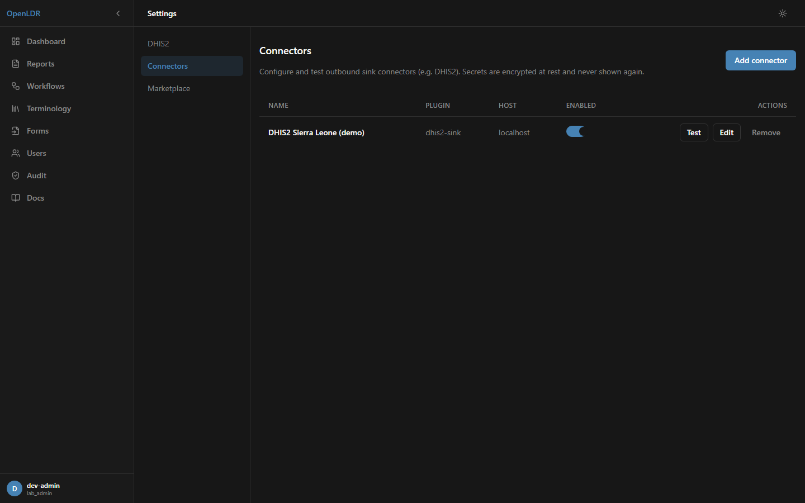

# DHIS2 Sink Plugin

Pushes OpenLDR aggregate (`dataValueSets`) and tracker (`events`) data to a DHIS2 instance.
The DHIS2 protocol and all HTTP egress run inside this WebAssembly plugin; the OpenLDR host
supplies the rows, the mapping, and the (encrypted) connection — so DHIS2 credentials never
live in the host's configuration.

## Prerequisites

- A DHIS2 server reachable from OpenLDR. For a local trial, OpenLDR ships a Docker profile
  with the DHIS2 2.40.3 Sierra Leone demo:
  - `pnpm dhis2:seed` (downloads the demo database once)
  - `docker compose --profile dhis2 up -d` → DHIS2 at `http://localhost:8085` (login `admin` / `district`)
- `SECRETS_ENCRYPTION_KEY` set on the OpenLDR server (`openssl rand -base64 32`). Connector
  secrets are AES-256-GCM encrypted at rest with this key.
- `REPORTING_TARGET_ADAPTER=dhis2` in the OpenLDR environment (enables the reporting-target wiring).
- The `dhis2-sink` plugin installed (from the Marketplace, or `openldr plugin install`).

## 1. Create a connector

Open **Settings ▸ Connectors**, click **Add connector**, pick the `dhis2-sink` plugin, and
enter the DHIS2 base URL, username, and password. Save. Secrets are write-only — to change
any connection field later, re-enter all of them together.

## 2. Test the connection

Click **Test** on the connector row. A successful test performs a live `health_check` and
`pull_metadata` against DHIS2 and shows the metadata counts inline.

The connector then appears in the list with its plugin, host, and enabled state.

## 3. Map and push

Create a DHIS2 mapping under **Settings ▸ DHIS2 ▸ Mappings** and select this connector on the
mapping. Then push from the mapping, from a schedule, or from a Workflow `dhis2-push` node
(the node selects a mapping, which carries the connector). A dry run returns the mapped
`dataValues` without any network egress; a real push POSTs to `/api/dataValueSets` and reports
the DHIS2 import summary (imported / updated / ignored / conflicts).

## Entry points (ABI)

`health_check`, `pull_metadata`, `push_aggregate`, `push_tracker` — each JSON in / JSON out.

## Capabilities

Declares `net-egress` intent only. The host pins the concrete DHIS2 host (the connector's
base URL) at call time, so the plugin has no ambient network access — least privilege.

## Verifying end to end (for developers)

`pnpm dhis2:accept` runs the live acceptance against the Docker DHIS2 demo: connector-store
round-trip → `health_check` → `pull_metadata` → dry-run → real push → reads the value back via
`GET /api/dataValueSets`.
